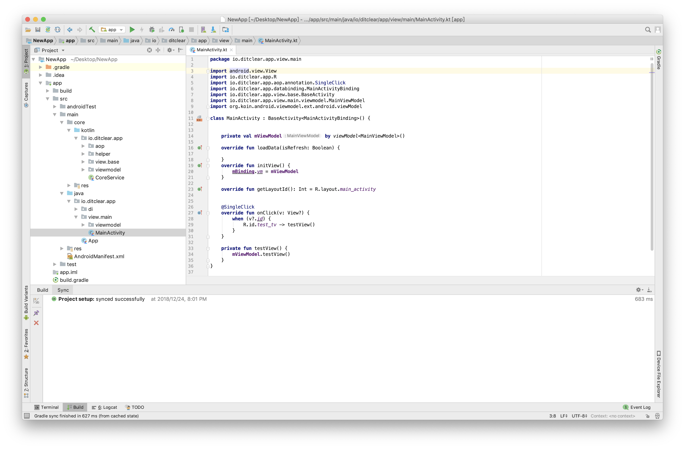

# generator-mvvm-kotlin

> An Kotlin MVVM Boilerplate for Android to save me having to create the same project over from scratch every time! :)

#### Stack：MVVM/Kotlin/DataBinding/Rxjava2/Retrofit2/AAC/Koin/AOP





### Installation

First, install [Yeoman](http://yeoman.io) and generator-mvvm-kotlin using [npm](https://www.npmjs.com/) (we assume you have pre-installed [node.js](https://nodejs.org/)).

```bash
npm install -g yo
npm install -g generator-mvvm-kotlin
```

Then generate your new project:

```bash
mkdir NewApp
cd NewApp
yo mvvm-kotlin
```

### Thanks To 

### [ravidsrk](https://github.com/ravidsrk)

#### If it saves your time , buy Me a Lunch ~

##### WeChat Pay


##### AliPay

|                                                              |                                                              |
| ------------------------------------------------------------ | ------------------------------------------------------------ |
|  |  |
